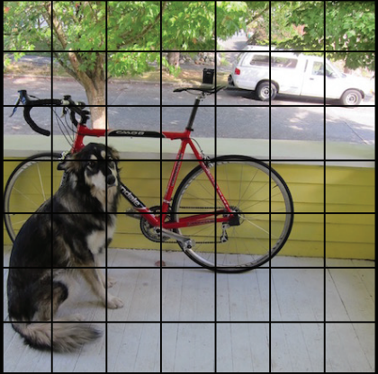
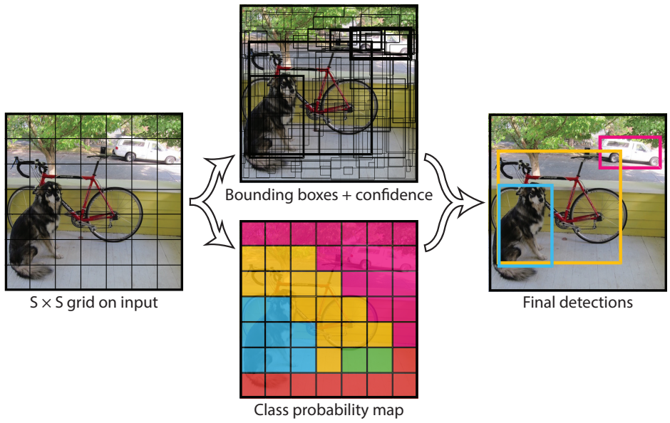
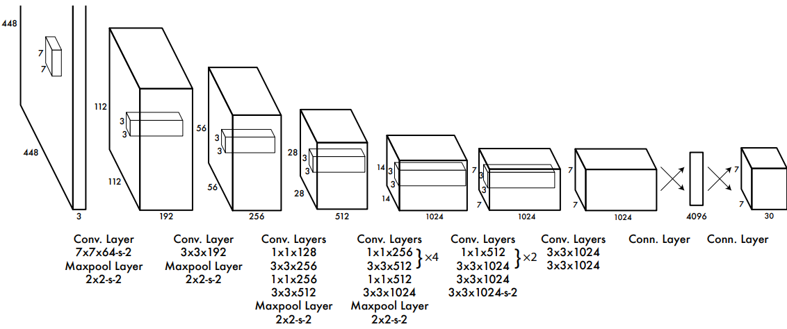
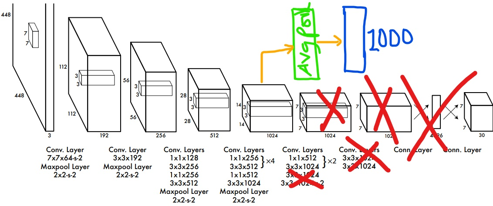

# YOLOv1 from scratch

This is a pytorch implementation of the paper "You Only Look Once:Unified, Real-Time Object Detection"

# How YOLO works
### TL;dr😴
YOLO is just a normal convnet that predicts the bounding boxes, class scores and confidence scores of bounding boxes in an image IN ONLY ONE FORWARD PASS.

The clever part of the algorithm is how the detection and localiztion problem is represented.

So we've got an image, we split the image up into an **S** X **S** grid (**S** = 7)

We make each box to be responsible for predicting **B** bounding boxes (**B** = 2), **B** Class scores (**C** = 20 in PascalVoc dataset) and a confidence level indicating how sure it is.

### But why is the number of bounding boxes per cell > 1??

It's been shown that making **B** > 1 (2 or 3) can increase the flexibility of the model and make the model learn "specialized" bounding box predictors for each cell in the grid.

For example, In one cell, there could be a bounding box that has better IoU for wider objects

The final prediction pipeline at test time is like this

The bounding boxes with the highest confidence are chosen for every grid cell. Even at that, there might still be duplicate boxes.
We remove duplicates with *Non-Maximal supression*.

The class label is simply the argmax over the class scores.

# Model architecture

The Design of the convolutional feature extractor was inspired by GoogLeNet. 1x1 convolutions were used for reducing the channel size for efficiency.

The first 20 layers of the network were trained on imagenet. The modified Imagenet network is like this (sorry for the poor diagram 🥴, but you get it)

PS: I lied when I said the we split the images into grids...We don't. But you can think of it that way😁.

## TinyYOLO
Theres a tiny version of the model with only 9 conv layers🤯

# Okay, I wanna Run it
